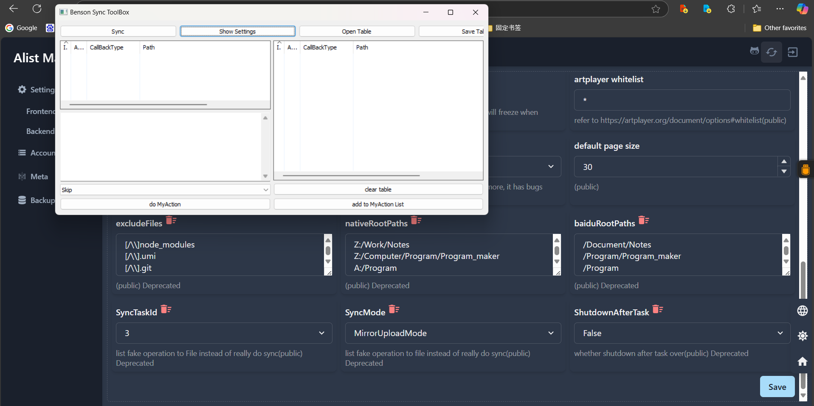

# 自制百度网盘同步工具——魔改版Alist



# 魔改版AList 2.1 更新

- 修复了文件上传经常失败的 Bug
- 加入了文件传输完成之后【关机】的额外功能
- 加入Linux系统【wget批量下载脚本】自动生成工具，无需安装百度网盘即可使用wget批量下载任意文件夹
- 优化了一些底层算法

# 魔改版AList 2.0 更新

## 新特性

- 自动添加下载队列（配合Internet Download Manager）

- 导出同步日志列表，导入同步日志列表（json格式）

- 在 `ListMode`下或其他模式中可以选择性批量上传、下载、删除某些文件，整个同步过程手动可控

- 引入四种同步模式

  | Mode                     | 本地没有的文件   | 大小不同的文件   | 网盘上没有的文件 | 相同的文件 |
  | ------------------------ | ---------------- | ---------------- | ---------------- | ---------- |
  | MirrorUploadMode镜像同步 | 删除网盘文件     | 上传本地文件     | 上传本地文件     | 跳过       |
  | ListMode清单模式         | 记录日志手动处理 | 记录日志手动处理 | 记录日志手动处理 | 跳过       |
  | DownloadMode下载模式     | 加入IDM下载队列  | 跳过             | 记录日志手动处理 | 跳过       |
  | UploadMode上传模式       | 跳过             | 跳过             | 上传本地文件     | 跳过       |

- 可选任务Id，任务编号从0开始。比如设置同步列表为

  ```shell
  nativeRootPaths：
  Z:/Work/Notes
  Z:/Computer/Program/Program_maker
  A:/Program
  A:/Software
  A:/Resource
  baiduRootPaths：
  /Document/Notes
  /Program/Program_maker
  /Program
  /Software
  /Resource
  ```

  则TaskId=2则会同步 `A:/Program` 文件夹到百度网盘的 `/Program`文件夹

- 

Internet Download Manager环境设置

- 设置UA头：在选项→下载→用户代理UA选项中设置UA为`pan.baidu.com`
- 将Internet Download Manager文件夹安装目录加入到系统环境变量如将路径 `D:\Program Files\idm 6.38.18.2`加入到环境变量

# 程序功能一览

- 多文件夹同步 —— 本地文件更新到网盘、本地不存在的文件，百度网盘需要删除，按比大小的方式更新
- 非md5摘要同步，按字节大小计算，提升程序运行速度
- 加入文件排除蒙版支持正则
- 暂停时暂存同步进度功能，充分利用碎片化时间——删除operator.gob缓存文件，重新同步
- 输出文件差异表，辅助人工同步
- 修复alist 文件列表Url字段为nil的bug
- 修复alist 0k文件传输bug
- 修复alist 无法获取隐藏文件bug
- 修复alist 上传大文件无进度条
- 10次内自动试错重传，超过10次重传失败，会提示人工审核，保证同步传输稳定性、有效性
- 修复百度网盘同名文件上传"+_日期"bug，delete+upload
- 批量拉黑文件

# 性能

3个小时内同步10-20级目录文件。

# 如何使用

- 创建Native账号和百度网盘账号

- http://www.delayboy.cn/BaiduDisk

  ```
  "client_id=kh0XKlKIj2TMIx9ROvuNa6bnX4oMtYBX&" +
  "client_secret=cn81eyeq7UrbtXUbhN2GoGL5H5SX58dz";
  ```

- 点击右上角clear buffer

- 再次点击clear buffer暂停

- 注意需要暂停才能保存同步进度，直接关闭控制台同步进度会丢失。

# 使用场景

- 向百度网盘上传大型文件夹后希望快速同步更新
- 借助同步列表手动选择要更新的文件


# 百度授权第三方客户端的安全性分析

- refresh token机制保证对第三方服务器的有限授权 -> 密钥时效性短，密钥1->密钥2->密钥3
- server:密钥1->密钥2->密钥3
- 存在文件丢失风险
- 极小概率丢失私密大文件
- 小概率丢失私密小文件
- 授权码盗用的可察觉性

